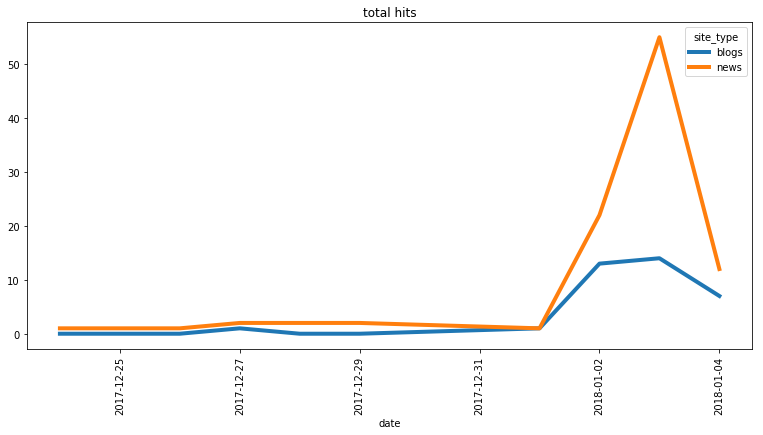
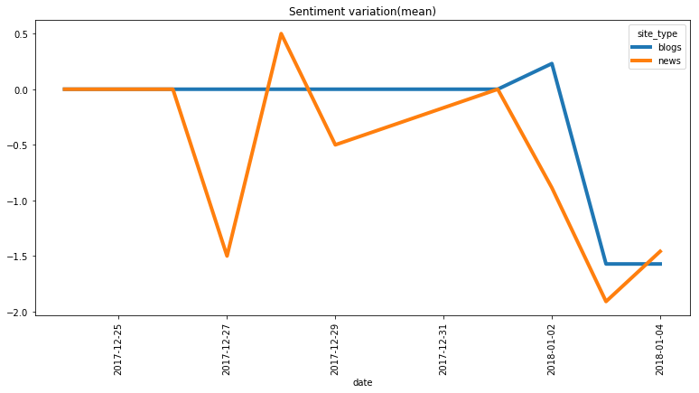
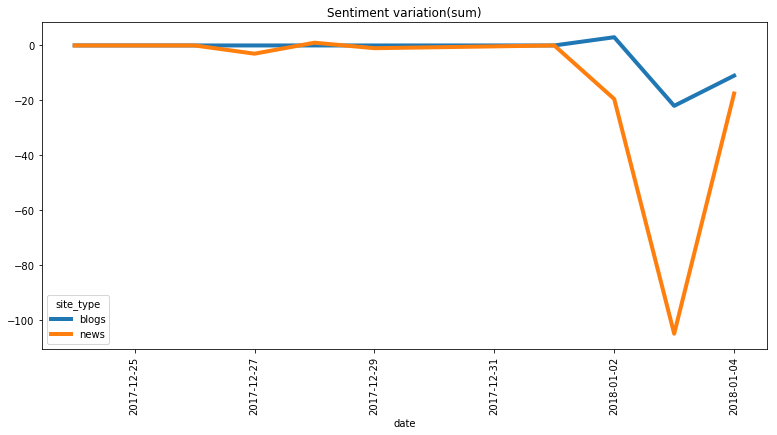
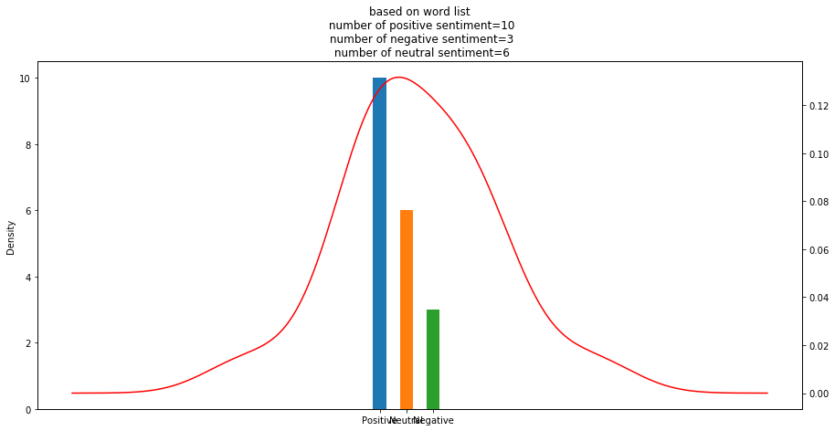
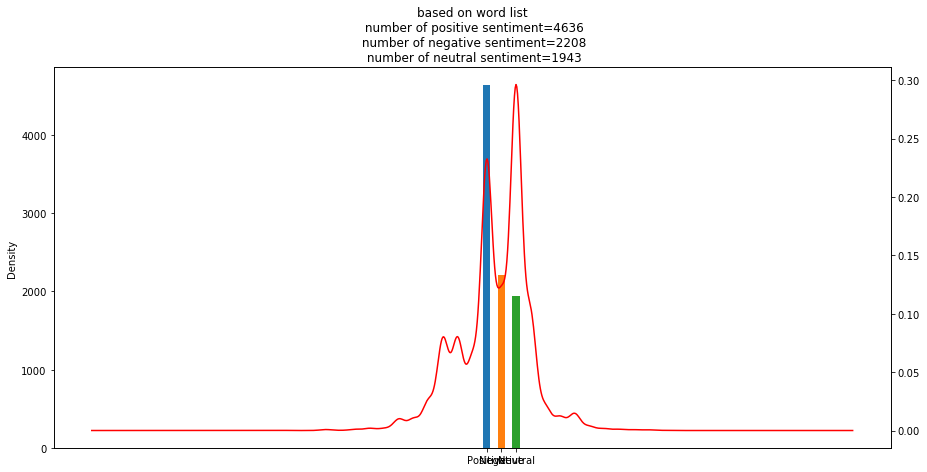

```python
from text_analytics_fns import *
%matplotlib inline
```

    load params
    loading model
    creating tensorflow session
    create model
    embd function
    loading Parameters
    create mlstm
    loading Parameters
    loading Parameters
    loading Parameters
    loading Parameters
    loading Parameters
    loading Parameters
    loading Parameters
    loading Parameters
    loading Parameters
    fully connected layer creation
    loading Parameters
    loading Parameters


### trending topics


```python
get_twitter_trend('bangalore')
```

    bangalore 23424848


    ['happybirthdaydeepikapadukone',
     'tukdetukdegang',
     'iplretention',
     'tskpressmeet',
     'kerpun',
     'kabul',
     'rs',
     'specialwatchlist',
     'manmohansingh',
     'bbmuseum',
     'learningtolovenehru',
     'keralacm',
     'quickheal',
     'mountbb',
     'jodhpur',
     'karnatakacm',
     'dalit',
     'rajyasabha',
     'umarkhalid',
     'talaqbilldivorced',
     'htanalysis',
     'terebina',
     'imaikkaanodigal',
     'busstrike',
     'savsind',
     'awdvmum',
     'toiwriteindia',
     'transport',
     'eeda',
     'maharashtrabandh',
     'thursdaythoughts',
     'kulbhushanjadhav',
     'bhimakoregaonviolence',
     'tiktiktikaudiolaunch',
     'baaghi',
     'fodderscam',
     'hubahu',
     'takeastep',
     'yaarivan',
     'kejriwal',
     'aweteaser',
     'ezeeresolution',
     'deepakrao',
     'dhaadikaara',
     'nayasaalwithearlysalary',
     'mybirthdaysongtrailer',
     'hbddeependerhooda',
     'natchathiravizha',
     'marol',
     'thalapathy']


## Blog/news analytics
### getting webhose(blog/news data)  
### preprocessing them

### realtime data
##### loading realtime news/blog data


```python
keywords=["mumbai","bandh"]
data_realtime=get_blog_data_realtime(keyword=keywords)
```

    Too many requests: used 1000 out of 1000 allowed in a month
    less than 10 requests are left


### historical data
##### loading historical news/blog data


```python
keywords=["mumbai","bandh"]
data_historical=get_blog_data_historical(keyword=keywords,timeduration=20)
```

    Too many requests: used 1000 out of 1000 allowed in a month
    less than 10 requests are left


### processing sentiment 
#### on whole data


```python
data_sentiment=get_sentiment_blog(data_historical,keywords, source='blogs',take_all_data=True)
```

#### on blog


```python
data_sentiment_blog=get_sentiment_blog(data_historical,keywords, source='blogs')
```

    (200, 30)
    (36, 30)


#### on news


```python
data_sentiment_news=get_sentiment_blog(data_historical,keywords, source='news')
```

    (200, 30)
    (99, 30)


### displaying blog output

#### keywords from blogs


```python
get_tfidf_keywords(data_sentiment_blog['text'].tolist())
```


<div>
<style scoped>
    .dataframe tbody tr th:only-of-type {
        vertical-align: middle;
    }

    .dataframe tbody tr th {
        vertical-align: top;
    }

    .dataframe thead th {
        text-align: right;
    }
</style>
<table border="1" class="dataframe">
  <thead>
    <tr style="text-align: right;">
      <th></th>
      <th>feature_names</th>
      <th>scores</th>
    </tr>
  </thead>
  <tbody>
    <tr>
      <th>11274</th>
      <td>maharashtra</td>
      <td>0.032738</td>
    </tr>
    <tr>
      <th>12234</th>
      <td>mumbai</td>
      <td>0.030058</td>
    </tr>
    <tr>
      <th>9226</th>
      <td>india</td>
      <td>0.024359</td>
    </tr>
    <tr>
      <th>5205</th>
      <td>dalit</td>
      <td>0.024349</td>
    </tr>
    <tr>
      <th>16204</th>
      <td>said</td>
      <td>0.024323</td>
    </tr>
    <tr>
      <th>4908</th>
      <td>cr</td>
      <td>0.022689</td>
    </tr>
    <tr>
      <th>16033</th>
      <td>rs</td>
      <td>0.021690</td>
    </tr>
    <tr>
      <th>7983</th>
      <td>government</td>
      <td>0.020548</td>
    </tr>
    <tr>
      <th>17560</th>
      <td>state</td>
      <td>0.020025</td>
    </tr>
    <tr>
      <th>5270</th>
      <td>dalits</td>
      <td>0.019671</td>
    </tr>
    <tr>
      <th>3338</th>
      <td>called</td>
      <td>0.019257</td>
    </tr>
    <tr>
      <th>14843</th>
      <td>pune</td>
      <td>0.018644</td>
    </tr>
    <tr>
      <th>9405</th>
      <td>indian</td>
      <td>0.017595</td>
    </tr>
    <tr>
      <th>12763</th>
      <td>news</td>
      <td>0.017134</td>
    </tr>
    <tr>
      <th>2363</th>
      <td>bandh</td>
      <td>0.017051</td>
    </tr>
    <tr>
      <th>19641</th>
      <td>violence</td>
      <td>0.016953</td>
    </tr>
    <tr>
      <th>505</th>
      <td>2018</td>
      <td>0.016481</td>
    </tr>
    <tr>
      <th>3554</th>
      <td>caste</td>
      <td>0.016177</td>
    </tr>
    <tr>
      <th>5378</th>
      <td>day</td>
      <td>0.015966</td>
    </tr>
    <tr>
      <th>10009</th>
      <td>january</td>
      <td>0.015877</td>
    </tr>
    <tr>
      <th>5034</th>
      <td>crore</td>
      <td>0.015875</td>
    </tr>
    <tr>
      <th>14073</th>
      <td>police</td>
      <td>0.015420</td>
    </tr>
    <tr>
      <th>20382</th>
      <td>year</td>
      <td>0.014377</td>
    </tr>
    <tr>
      <th>16346</th>
      <td>salman</td>
      <td>0.014192</td>
    </tr>
    <tr>
      <th>17081</th>
      <td>shutdown</td>
      <td>0.014045</td>
    </tr>
    <tr>
      <th>12702</th>
      <td>new</td>
      <td>0.013993</td>
    </tr>
    <tr>
      <th>3280</th>
      <td>business</td>
      <td>0.013980</td>
    </tr>
    <tr>
      <th>7198</th>
      <td>film</td>
      <td>0.013915</td>
    </tr>
    <tr>
      <th>4051</th>
      <td>city</td>
      <td>0.013846</td>
    </tr>
    <tr>
      <th>450</th>
      <td>2017</td>
      <td>0.013575</td>
    </tr>
    <tr>
      <th>...</th>
      <td>...</td>
      <td>...</td>
    </tr>
    <tr>
      <th>14145</th>
      <td>politics boil</td>
      <td>0.000319</td>
    </tr>
    <tr>
      <th>14146</th>
      <td>politics boil violence</td>
      <td>0.000319</td>
    </tr>
    <tr>
      <th>3593</th>
      <td>caste workers disrupt</td>
      <td>0.000319</td>
    </tr>
    <tr>
      <th>14147</th>
      <td>politics maharashtra</td>
      <td>0.000319</td>
    </tr>
    <tr>
      <th>14148</th>
      <td>politics maharashtra homeland</td>
      <td>0.000319</td>
    </tr>
    <tr>
      <th>14206</th>
      <td>posted</td>
      <td>0.000319</td>
    </tr>
    <tr>
      <th>14207</th>
      <td>posted 2018</td>
      <td>0.000319</td>
    </tr>
    <tr>
      <th>14208</th>
      <td>posted 2018 01</td>
      <td>0.000319</td>
    </tr>
    <tr>
      <th>10828</th>
      <td>led nda government</td>
      <td>0.000319</td>
    </tr>
    <tr>
      <th>10827</th>
      <td>led nda</td>
      <td>0.000319</td>
    </tr>
    <tr>
      <th>20196</th>
      <td>winter session parliament</td>
      <td>0.000319</td>
    </tr>
    <tr>
      <th>8357</th>
      <td>haerther http www</td>
      <td>0.000319</td>
    </tr>
    <tr>
      <th>8356</th>
      <td>haerther http</td>
      <td>0.000319</td>
    </tr>
    <tr>
      <th>115</th>
      <td>09 pm</td>
      <td>0.000319</td>
    </tr>
    <tr>
      <th>3566</th>
      <td>caste dalits took</td>
      <td>0.000319</td>
    </tr>
    <tr>
      <th>10899</th>
      <td>life mumbai</td>
      <td>0.000319</td>
    </tr>
    <tr>
      <th>5799</th>
      <td>dftba</td>
      <td>0.000319</td>
    </tr>
    <tr>
      <th>5791</th>
      <td>developed youtube hundreds</td>
      <td>0.000319</td>
    </tr>
    <tr>
      <th>5790</th>
      <td>developed youtube</td>
      <td>0.000319</td>
    </tr>
    <tr>
      <th>116</th>
      <td>09 pm ist</td>
      <td>0.000319</td>
    </tr>
    <tr>
      <th>3560</th>
      <td>caste clash criticizing</td>
      <td>0.000319</td>
    </tr>
    <tr>
      <th>18466</th>
      <td>thumbnail joe cieplinski</td>
      <td>0.000319</td>
    </tr>
    <tr>
      <th>3578</th>
      <td>caste protests india</td>
      <td>0.000319</td>
    </tr>
    <tr>
      <th>18465</th>
      <td>thumbnail joe</td>
      <td>0.000319</td>
    </tr>
    <tr>
      <th>18464</th>
      <td>thumbnail</td>
      <td>0.000319</td>
    </tr>
    <tr>
      <th>2321</th>
      <td>baba</td>
      <td>0.000319</td>
    </tr>
    <tr>
      <th>2322</th>
      <td>baba maharashtra</td>
      <td>0.000319</td>
    </tr>
    <tr>
      <th>2323</th>
      <td>baba maharashtra caste</td>
      <td>0.000319</td>
    </tr>
    <tr>
      <th>3577</th>
      <td>caste protests</td>
      <td>0.000319</td>
    </tr>
    <tr>
      <th>4001</th>
      <td>cieplinski http joecieplinski</td>
      <td>0.000319</td>
    </tr>
  </tbody>
</table>
<p>20608 rows × 2 columns</p>
</div>


#### keywords from news


```python
get_tfidf_keywords(data_sentiment_news['text'].tolist())
```


<div>
<style scoped>
    .dataframe tbody tr th:only-of-type {
        vertical-align: middle;
    }

    .dataframe tbody tr th {
        vertical-align: top;
    }

    .dataframe thead th {
        text-align: right;
    }
</style>
<table border="1" class="dataframe">
  <thead>
    <tr style="text-align: right;">
      <th></th>
      <th>feature_names</th>
      <th>scores</th>
    </tr>
  </thead>
  <tbody>
    <tr>
      <th>21796</th>
      <td>maharashtra</td>
      <td>0.030248</td>
    </tr>
    <tr>
      <th>24039</th>
      <td>mumbai</td>
      <td>0.027951</td>
    </tr>
    <tr>
      <th>40258</th>
      <td>violence</td>
      <td>0.026216</td>
    </tr>
    <tr>
      <th>20272</th>
      <td>koregaon</td>
      <td>0.025874</td>
    </tr>
    <tr>
      <th>32719</th>
      <td>said</td>
      <td>0.025662</td>
    </tr>
    <tr>
      <th>5290</th>
      <td>bhima</td>
      <td>0.024533</td>
    </tr>
    <tr>
      <th>10269</th>
      <td>dalit</td>
      <td>0.023629</td>
    </tr>
    <tr>
      <th>29749</th>
      <td>pune</td>
      <td>0.021919</td>
    </tr>
    <tr>
      <th>5320</th>
      <td>bhima koregaon</td>
      <td>0.021520</td>
    </tr>
    <tr>
      <th>17930</th>
      <td>india</td>
      <td>0.021297</td>
    </tr>
    <tr>
      <th>28002</th>
      <td>police</td>
      <td>0.020009</td>
    </tr>
    <tr>
      <th>2921</th>
      <td>ambedkar</td>
      <td>0.019547</td>
    </tr>
    <tr>
      <th>10441</th>
      <td>dalits</td>
      <td>0.018087</td>
    </tr>
    <tr>
      <th>35814</th>
      <td>state</td>
      <td>0.017962</td>
    </tr>
    <tr>
      <th>4537</th>
      <td>bandh</td>
      <td>0.017361</td>
    </tr>
    <tr>
      <th>34032</th>
      <td>services</td>
      <td>0.016949</td>
    </tr>
    <tr>
      <th>7201</th>
      <td>caste</td>
      <td>0.015614</td>
    </tr>
    <tr>
      <th>2605</th>
      <td>airport</td>
      <td>0.015060</td>
    </tr>
    <tr>
      <th>6688</th>
      <td>called</td>
      <td>0.014773</td>
    </tr>
    <tr>
      <th>29443</th>
      <td>protests</td>
      <td>0.014671</td>
    </tr>
    <tr>
      <th>38117</th>
      <td>today</td>
      <td>0.014297</td>
    </tr>
    <tr>
      <th>4897</th>
      <td>battle</td>
      <td>0.013895</td>
    </tr>
    <tr>
      <th>15586</th>
      <td>government</td>
      <td>0.013751</td>
    </tr>
    <tr>
      <th>19297</th>
      <td>january</td>
      <td>0.013750</td>
    </tr>
    <tr>
      <th>6513</th>
      <td>buses</td>
      <td>0.013304</td>
    </tr>
    <tr>
      <th>29186</th>
      <td>protest</td>
      <td>0.013286</td>
    </tr>
    <tr>
      <th>15913</th>
      <td>groups</td>
      <td>0.013219</td>
    </tr>
    <tr>
      <th>21807</th>
      <td>maharashtra bandh</td>
      <td>0.013017</td>
    </tr>
    <tr>
      <th>30202</th>
      <td>railway</td>
      <td>0.012273</td>
    </tr>
    <tr>
      <th>10724</th>
      <td>day</td>
      <td>0.012198</td>
    </tr>
    <tr>
      <th>...</th>
      <td>...</td>
      <td>...</td>
    </tr>
    <tr>
      <th>30841</th>
      <td>reddy pmla case</td>
      <td>0.000188</td>
    </tr>
    <tr>
      <th>10006</th>
      <td>crore foreign domestics</td>
      <td>0.000188</td>
    </tr>
    <tr>
      <th>32476</th>
      <td>rules stride</td>
      <td>0.000188</td>
    </tr>
    <tr>
      <th>32477</th>
      <td>rules stride rollout</td>
      <td>0.000188</td>
    </tr>
    <tr>
      <th>10005</th>
      <td>crore foreign</td>
      <td>0.000188</td>
    </tr>
    <tr>
      <th>1477</th>
      <td>54</td>
      <td>0.000188</td>
    </tr>
    <tr>
      <th>1478</th>
      <td>54 pm</td>
      <td>0.000188</td>
    </tr>
    <tr>
      <th>9282</th>
      <td>congress tmc wednesday</td>
      <td>0.000188</td>
    </tr>
    <tr>
      <th>41081</th>
      <td>wednesday alleged bjp</td>
      <td>0.000188</td>
    </tr>
    <tr>
      <th>41110</th>
      <td>wednesday face government</td>
      <td>0.000188</td>
    </tr>
    <tr>
      <th>41109</th>
      <td>wednesday face</td>
      <td>0.000188</td>
    </tr>
    <tr>
      <th>17186</th>
      <td>hospitals run far</td>
      <td>0.000188</td>
    </tr>
    <tr>
      <th>17185</th>
      <td>hospitals run</td>
      <td>0.000188</td>
    </tr>
    <tr>
      <th>17184</th>
      <td>hospitals delhi high</td>
      <td>0.000188</td>
    </tr>
    <tr>
      <th>17183</th>
      <td>hospitals delhi</td>
      <td>0.000188</td>
    </tr>
    <tr>
      <th>14453</th>
      <td>flights canceled</td>
      <td>0.000188</td>
    </tr>
    <tr>
      <th>14454</th>
      <td>flights canceled 235</td>
      <td>0.000188</td>
    </tr>
    <tr>
      <th>14467</th>
      <td>flights getting canceled</td>
      <td>0.000188</td>
    </tr>
    <tr>
      <th>41080</th>
      <td>wednesday alleged</td>
      <td>0.000188</td>
    </tr>
    <tr>
      <th>9281</th>
      <td>congress tmc</td>
      <td>0.000188</td>
    </tr>
    <tr>
      <th>41079</th>
      <td>wednesday aim make</td>
      <td>0.000188</td>
    </tr>
    <tr>
      <th>41078</th>
      <td>wednesday aim</td>
      <td>0.000188</td>
    </tr>
    <tr>
      <th>30872</th>
      <td>reduction united nations</td>
      <td>0.000188</td>
    </tr>
    <tr>
      <th>1479</th>
      <td>54 pm ist</td>
      <td>0.000188</td>
    </tr>
    <tr>
      <th>17170</th>
      <td>hospital wrongly declaring</td>
      <td>0.000188</td>
    </tr>
    <tr>
      <th>17169</th>
      <td>hospital wrongly</td>
      <td>0.000188</td>
    </tr>
    <tr>
      <th>17168</th>
      <td>hospital ventilator died</td>
      <td>0.000188</td>
    </tr>
    <tr>
      <th>17167</th>
      <td>hospital ventilator</td>
      <td>0.000188</td>
    </tr>
    <tr>
      <th>30871</th>
      <td>reduction united</td>
      <td>0.000188</td>
    </tr>
    <tr>
      <th>19077</th>
      <td>ist markets european</td>
      <td>0.000188</td>
    </tr>
  </tbody>
</table>
<p>42301 rows × 2 columns</p>
</div>


#### total number hits(news/blogs) w.r.t. time


```python
total_hits=data_sentiment.pivot_table(columns='site_type',index='date'\
                   ,values='median_sentiment_level',aggfunc='count').fillna(0)
total_hits.plot(figsize=(13,6),rot=90,lw=4,title='total hits')
```


    <matplotlib.axes._subplots.AxesSubplot at 0x7f474c03f630>





#### mean sentiment w.r.t. time


```python
sentiment_levels=data_sentiment.pivot_table(columns='site_type',index='date',\
                   values='median_sentiment_level',aggfunc='mean').fillna(0)
sentiment_levels.plot(figsize=(13,6),rot=90,lw=4,title='Sentiment variation(mean)')
```


    <matplotlib.axes._subplots.AxesSubplot at 0x7f472ea08e48>





```python
sentiment_levels=data_sentiment.pivot_table(columns='site_type',index='date',\
                   values='median_sentiment_level',aggfunc='sum').fillna(0)
sentiment_levels.plot(figsize=(13,6),rot=90,lw=4,title='Sentiment variation(sum)')
```


    <matplotlib.axes._subplots.AxesSubplot at 0x7f472e99a320>





#### sentiment description w.r.t. site types


```python
site_stat=data_sentiment.groupby('site_type').agg({'median_sentiment_level':['mean','max','median','std','count']})
site_stat
```


<div>
<style scoped>
    .dataframe tbody tr th:only-of-type {
        vertical-align: middle;
    }

    .dataframe tbody tr th {
        vertical-align: top;
    }

    .dataframe thead tr th {
        text-align: left;
    }

    .dataframe thead tr:last-of-type th {
        text-align: right;
    }
</style>
<table border="1" class="dataframe">
  <thead>
    <tr>
      <th></th>
      <th colspan="5" halign="left">median_sentiment_level</th>
    </tr>
    <tr>
      <th></th>
      <th>mean</th>
      <th>max</th>
      <th>median</th>
      <th>std</th>
      <th>count</th>
    </tr>
    <tr>
      <th>site_type</th>
      <th></th>
      <th></th>
      <th></th>
      <th></th>
      <th></th>
    </tr>
  </thead>
  <tbody>
    <tr>
      <th>blogs</th>
      <td>-0.833333</td>
      <td>2.0</td>
      <td>0.0</td>
      <td>1.828348</td>
      <td>36</td>
    </tr>
    <tr>
      <th>news</th>
      <td>-1.464646</td>
      <td>1.0</td>
      <td>-1.0</td>
      <td>2.155028</td>
      <td>99</td>
    </tr>
  </tbody>
</table>
</div>


```python
# #### mean sentiment w.r.t.  source
# sent_source=data_sentiment.head(100).groupby(['site','site_type']).agg({'median_sentiment_level':'mean'})
# sent_source.plot(kind='barh',figsize=(10,min(50,int(.5*sent_source.shape[0]))),lw=4,title='mean sentiment level')
```

### summary from blog output

#### getting  summarized text for each text


```python
print(summarize_combined(data_sentiment['text'].tolist()))
```

    The Battle of Koregaon was fought on January 1, 1818 between the British East India Company and the Peshwa faction of the Maratha Confederacy, at Koregaon Bhima. The Battle of Koregaon was fought on January 1, 1818 between the British East India Company and the Peshwa faction of the Maratha Confederacy, at Koregaon Bhima. The Battle of Koregaon was fought on January 1, 1818 between the British East India Company and the Peshwa faction of the Maratha Confederacy, at Koregaon Bhima. The Battle of Koregaon was fought on January 1, 1818 between the British East India Company and the Peshwa faction of the Maratha Confederacy, at Koregaon Bhima.


#### summary of news


```python
print(summarize_combined(data_sentiment_news['text'].tolist()))
```

    The Battle of Koregaon was fought on January 1, 1818 between the British East India Company and the Peshwa faction of the Maratha Confederacy, at Koregaon Bhima. The Battle of Koregaon was fought on January 1, 1818 between the British East India Company and the Peshwa faction of the Maratha Confederacy, at Koregaon Bhima. The Battle of Koregaon was fought on January 1, 1818 between the British East India Company and the Peshwa faction of the Maratha Confederacy, at Koregaon Bhima. The Battle of Koregaon was fought on January 1, 1818 between the British East India Company and the Peshwa faction of the Maratha Confederacy, at Koregaon Bhima.


#### summary of blog


```python
print(summarize_combined(data_sentiment_blog['text'].tolist()))
```

    Unsubscribe Receive this alert as RSS feed Send Feedback Go Winter Session of Parliament: Congress\'s Mallikarjun Kharge calls PM Modi \'mauni baba\' on Maharashtra caste clash Criticizing Prime Minister Narendra Modi on the issue of caste-based violence in Maharashtra, Congress' senior leader Mallikarjun Kharge, who is also the Leader of the Opposition in the Lok Sabha, alleged that "anti-Dalit violence is increasing" in the country under Modi-led NDA government. Here is our new sketch on different types of people that they become after the break up.... India's 'moonwalking' traffic cop turns heads published: 28 Dec 2017 India's 'moonwalking' traffic cop turns heads India's 'moonwalking' traffic cop turns heads published: 28 Dec 2017 views: 255 Traffic cop Ranjeet Singh\'s Michael Jackson dance moves grab attention on the chaotic streets of Indore in India.... India's 'moonwalking' traffic cop turns heads published: 28 Dec 2017 views: 255 Traffic cop Ranjeet Singh\'s Michael Jackson dance moves grab attention on the chaotic streets of Indore in India.... IndiaTV News Live | Gujarat & Himachal Election Results published: 16 Nov 2017 IndiaTV News Live | Gujarat & Himachal Election Results IndiaTV News Live | Gujarat & Himachal Election Results published: 16 Nov 2017 views: 4232963 Watch IndiaTV news LIVE for all the latest news on Politics, Sports, Entertainment and much more in Hindi. For More Videos Visit: http://www.indiatvnews.com/video Follow IndiaTV: Facebook: http://www.fb.com/indiatvnews | Twitter: http://twitter.com/indiatvnews Download IndiaTV News Apps: Android: https://goo.gl/30MHqS | iOS: https://goo.gl/7C5Epr Download IndiaTV Live TV Apps: Android: https://goo.gl/VqkMIa | iOS: https://goo.gl/4rzvVn देश -विदेश की ताजा खबरें पढ़ने के लिए क्लिक करें हमारी हिन्‍दी वेबसाइट : http://www.khabarindiatv.com बिजनेस जगत की ताजा हलचल और स्‍पेशल रिपोर्ट जानने के लिए क्लिक करें : http://www.indiatvpaisa.com SUBSCRIBE to IndiaTV Here: http://bit.ly/indiatv_sub... Lil Durk - India (Official Audio) published: 19 Oct 2017 Lil Durk - India (Official Audio) Lil Durk - India (Official Audio) published: 19 Oct 2017 views: 4182272 Listen to the official audio of \"India\" by Lil Durk Subscribe to Lil Durk\'s official channel for exclusive music videos and behind the scenes looks: http://bit.ly/Subscribe-to-Durk More Lil Durk: https://fb.com/lildurk https://twitter.com/lildurk_ https://instagram.com/Imlildurk2x http://officiallildurk.com... Lil Durk - India (Official Audio) published: 19 Oct 2017 views: 4182272 Listen to the official audio of \"India\" by Lil Durk Subscribe to Lil Durk\'s official channel for exclusive music videos and behind the scenes looks: http://bit.ly/Subscribe-to-Durk More Lil Durk: https://fb.com/lildurk https://twitter.com/lildurk_ https://instagram.com/Imlildurk2x http://officiallildurk.com... published: 05 Dec 2017 views: 31592 Build your website for 10% off by going to http://squarespace.com/wendover Subscribe to Half as Interesting (The other channel from Wendover Productions): https://www.youtube.com/halfasinteresting Check out my podcast with Brian from Real Engineering: https://itunes.apple.com/us/podcast/showmakers/id1224583218?mt=2 (iTunes link) https://www.youtube.com/channel/UC_10vJJqf2ZK0lWrb5BXAPg (YouTube link) Support Wendover Productions on Patreon: https://www.patreon.com/wendoverproductions Get a Wendover Productions t-shirt for $20: https://store.dftba.com/products/wendover-productions-shirt Youtube: http://www.YouTube.com/WendoverProductions Twitter: http://www.Twitter.com/WendoverPro Email: WendoverProductions@gmail.com Reddit: http://Reddit.com/r/WendoverProductions Animation by Josh Sherrington (https://www.youtube.com/heliosphere) Sound by Graham Haerther (http://www.Haerther.net) Thumbnail by Joe Cieplinski (http://joecieplinski.com/ Bandh throws life out of gear in Mumbai, Pune - The Indian Express The Indian ExpressBandh throws life out of gear in Mumbai, PuneThe Indian ExpressAcross the state, 30 people were arrested, 15 by Aurangabad (city) police and 13 by Pune (rural) cops, and 1,278 people detained under the Maharashtra (Bombay) Police Act. DNA 23 hours ago - India After generating tension in Mumbai, Pune and a few other cities in Maharashtra, the state-wide bandh, called by Dalit organisations to protest the violence post... Firstpost Members of the Dalit community shout slogans as they participate in a protest rally in Mumbai, January 3, 2018.


## twitter  analysis

### twitter stream analysis


```python
tweets_df=get_tweets(keywords=['modi', 'NDA', 'kejriwal', 'iot'], time_limit=5, location='India')

tweets_df_word_li,tweet_stat=plot_twitter_stats(tweets_df)
tweet_stat
```

    bounding box for India [97.39535869999999, 35.5087008, 68.1097, 6.4626999]
    406
    406


<div>
<style scoped>
    .dataframe tbody tr th:only-of-type {
        vertical-align: middle;
    }

    .dataframe tbody tr th {
        vertical-align: top;
    }

    .dataframe thead th {
        text-align: right;
    }
</style>
<table border="1" class="dataframe">
  <thead>
    <tr style="text-align: right;">
      <th></th>
      <th>0</th>
    </tr>
  </thead>
  <tbody>
    <tr>
      <th>number of negative revies</th>
      <td>3</td>
    </tr>
    <tr>
      <th>number of neutral reviews</th>
      <td>6</td>
    </tr>
    <tr>
      <th>number of positive reviews</th>
      <td>10</td>
    </tr>
    <tr>
      <th>most negative sentiment</th>
      <td>6    Totally counterproductive and idiotic pol...</td>
    </tr>
    <tr>
      <th>most positive sentiment</th>
      <td>10    @docpensive @narendramodi @AmitShah So i...</td>
    </tr>
  </tbody>
</table>
</div>





### twitter historical  data


```python
tweets_df=get_hist_tweets(q='modi', count=100, result_type='recent', location='bangalore', distance='100km', days=7)

tweets_df_word_li,tweet_stat=plot_twitter_stats(tweets_df)
tweet_stat
```


<div>
<style scoped>
    .dataframe tbody tr th:only-of-type {
        vertical-align: middle;
    }

    .dataframe tbody tr th {
        vertical-align: top;
    }

    .dataframe thead th {
        text-align: right;
    }
</style>
<table border="1" class="dataframe">
  <thead>
    <tr style="text-align: right;">
      <th></th>
      <th>0</th>
    </tr>
  </thead>
  <tbody>
    <tr>
      <th>number of negative revies</th>
      <td>2208</td>
    </tr>
    <tr>
      <th>number of neutral reviews</th>
      <td>1943</td>
    </tr>
    <tr>
      <th>number of positive reviews</th>
      <td>4636</td>
    </tr>
    <tr>
      <th>most negative sentiment</th>
      <td>3453    VERY SAD TO SEE WICKED CONGRESS AND PR...</td>
    </tr>
    <tr>
      <th>most positive sentiment</th>
      <td>4363    @narendramodi Modi Jai my Indian pm to...</td>
    </tr>
  </tbody>
</table>
</div>




